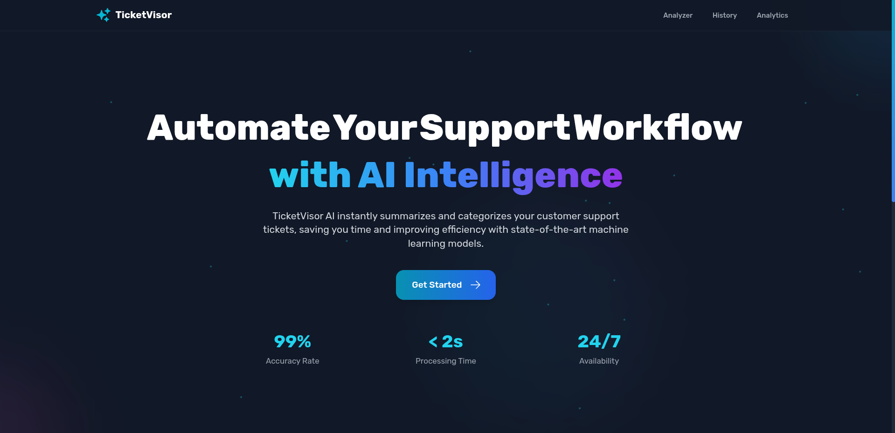
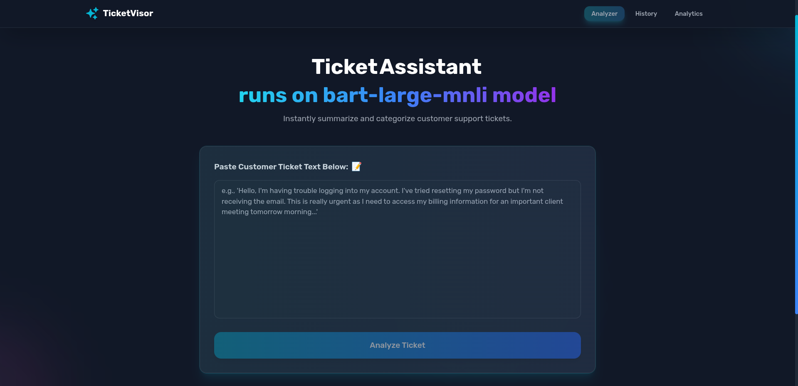

# TicketVisor: AI-Powered Customer Support Ticket Assistant



TicketVisor is a full-stack web application designed to showcase a modern, production-grade software architecture for solving a high-value business problem: the manual processing of customer support tickets. This application leverages AI models to automatically summarize and categorize incoming tickets, providing a powerful dashboard for analytics and historical review.

## Features

*   **AI-Powered Summarization:** Utilizes the T5-Base transformer model to generate concise, human-readable summaries of long and complex support ticket text.
*   **Zero-Shot Categorization:** Employs a BART-based model for zero-shot text classification, allowing for dynamic and accurate categorization of tickets into labels like "Billing," "Technical Support," or "Bug Report" without any model retraining.
*   **Interactive Analytics Dashboard:** A dedicated analytics page with interactive charts (powered by Chart.js) to visualize key metrics like ticket volume and category distribution.
*   **Full History & Logging:** Every processed ticket and its AI-generated result is saved to a MongoDB database, providing a complete, searchable log of all activity.
*   **Containerized & Scalable:** The entire application stack (React Frontend, FastAPI Backend, MongoDB) is fully containerized using Docker and orchestrated with Docker Compose, demonstrating best practices for deployment and scalability.

##  Tech Stack

#### **Frontend**
*   **Framework:** React.js 
*   **Routing:** React Router
*   **Styling:** Tailwind CSS
*   **Animations:** Framer Motion
*   **Data Visualization:** Chart.js (with `react-chartjs-2`)
*   **HTTP Client:** Axios

#### **Backend (API & AI)**
*   **Framework:** Python with **FastAPI**
*   **AI Models:** Hugging Face Transformers
    *   Summarization: `t5-base`
    *   Classification: `facebook/bart-large-mnli`
*   **Database:** MongoDB (with `pymongo`)
*   **Async Server:** Uvicorn

#### **Infrastructure & DevOps**
*   **Containerization:** Docker
*   **Orchestration:** Docker Compose
*   **Web Server (for Frontend):** Nginx

---

##  Getting Started

### Prerequisites

*   [Docker](https://www.docker.com/products/docker-desktop/) and [Docker Compose](https://docs.docker.com/compose/install/) must be installed on your local machine.
*   Ensure Docker Desktop has at least **4-6 GB of RAM** allocated to it, as the AI models are memory-intensive.

### Installation & Running the Application

This project is fully containerized.

1.  **Clone the repository:**
    ```bash
    git clone https://github.com/your-username/ai-ticket-summarizer.git
    cd ai-ticket-summarizer
    ```

2.  **Build and run the containers using Docker Compose:**
    From the root directory, run the following command:
    ```bash
    docker compose up --build
    ```

3.  **Be Patient on First Launch:** The first time you run this command, Docker will download the Python base image and the large AI models from Hugging Face (~2.5 GB). This process can take **5-20 minutes** depending on your internet connection. This is a one-time setup. Subsequent launches will be much faster.

4.  **Access the application:**
    *   **Frontend (Landing Page):** [http://localhost:3000](http://localhost:3000)
    *   **Backend (API):** [http://localhost:8000](http://localhost:8000) (You should see `{"status":"TicketVisor API is running"}`)

---


### Ticket Analysis Interface


The main application page features a modern, intuitive interface where support agents can paste customer support tickets for instant AI-powered analysis. The interface includes:
- **Clean Input Area:** A spacious text field for entering or pasting customer ticket content
- **Smart Analysis:** Real-time AI processing that generates concise summaries and automatically categorizes tickets
- **Category Detection:** Automatic classification into categories like Technical Support, Billing, Bug Report, and more
- **Modern UI:** Glass morphism design with smooth animations and gradients for an enhanced user experience

### Ticket History & Analytics


The history page provides a comprehensive view of all processed tickets with powerful analytics capabilities:
- **Statistics Dashboard:** Key metrics displayed at a glance, including total tickets processed and category distribution
- **Searchable History:** Full list of previously analyzed tickets with expandable cards
- **Detailed Records:** Each ticket entry shows the original text, AI-generated summary, category classification, and timestamp
- **Visual Analytics:** Category distribution charts help identify common support patterns and trends
- **Persistent Storage:** All ticket data is saved to MongoDB for long-term tracking and analysis